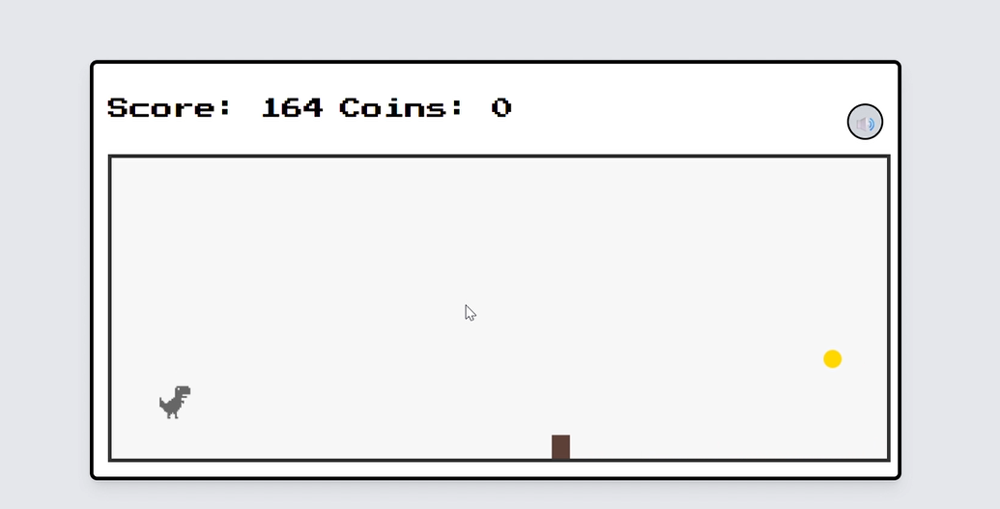

# Dino RPG Runner 🦖✨

<details>
<summary>🇯🇵 日本語のドキュメントを表示 (Click to expand)</summary>

# ディノ RPG ランナー (Dino RPG Runner) 🦖✨

**Google Chrome の恐竜ゲーム（Dino game）に、RPG要素を組み合わせたシンプルなスクロールアクションゲームです！**

---

## 🎮 ゲームについて

『Dino RPG Runner』は、おなじみの恐竜ランナーゲームをベースに、コイン集め、自動戦闘、商人との取引といったRPG要素を取り入れたオリジナルゲームです。
障害物をジャンプで避けながら、ハイスコアを目指して走り続けましょう！

スコアが一定に達するごとにユニークな商人がランダムに現れ、集めたコインを使って冒険に役立つアイテムを購入することができます。

<div align="center">
  
</div>

---

## ✨ 主な特徴・機能

* **シンプルな操作**: スペースキーを押すか、画面をタップするだけでジャンプできます。
* **RPG要素**: 敵との自動戦闘、コイン回収、スコアリングシステムを搭載しています。
* **ランダムに出現する商人**: スコアが1000点増えるごとに、2種類の商人がランダムで現れます。
* **パワーアップアイテム**:
  * **シールド（盾）** – 障害物への衝突を一度だけ無効化します。
  * **スコアブースト** – 敵を倒した時に獲得できるスコアが2倍になります。
* **少しずつ上がる難易度**: スコアが高くなるにつれて、走るスピードがだんだん速くなります。
* **BGM & ミュート機能**: ゲーム中に音楽が流れ、ON/OFFをいつでも切り替えられます。

---

## 🎮 遊び方

1. **スタート**: `Start` ボタンを押すか、スペースキーを押すと始まります。
2. **ジャンプ**: スペースキーを押すか、画面をタップして障害物を飛び越えます。
3. **ゲームの目的**:
   * 茶色い岩（障害物）を避けてください。当たるとゲームオーバーになります。
   * 黄色のコインを集めましょう。
   * 赤い敵は、キャラクターが自動的に攻撃して倒してくれます。
4. **商人との取引**:
   * 1000点ごとに商人が現れます。
   * コインを使い、ゲームを有利に進めるアイテムを購入しましょう。

---

## 🛠️ 使用している技術

* **HTML5** – ゲームの骨組み
* **CSS3 (Tailwind CSS)** – 画面のデザインとレイアウト
* **JavaScript (ES6+)** – ゲーム全体の動きやロジック

---

## 🚀 ローカルでの動かし方

パソコン上でこのゲームを動かすには、以下の手順に従ってください。

1. リポジトリをダウンロード（クローン）します：
    ```sh
    git clone https://github.com/YOUR_USERNAME/dino-rpg-runner.git
    ```
2. プロジェクトのフォルダに移動します：
    ```sh
    cd dino-rpg-runner
    ```
3. `index.html` ファイルをブラウザで開きます。

**注意:** ゲームが正しく表示され動作するために、以下のファイルが `index.html` と同じフォルダにあることを確認してください：
* `game.js`
* `dino_player.png` （プレイヤーの画像）
* `merchant1.png` （商人1の画像）
* `merchant2.png` （商人2の画像）
* `background_music.mp3` （BGM音楽ファイル）

---

## 📜 ライセンス

このプロジェクトは [MIT ライセンス](https://opensource.org/licenses/MIT) のもとで公開されています。

</details>

<details>
<summary>🇺🇸 Show English Document (Click to expand)</summary>

# Dino RPG Runner 🦖✨

<p align="center">
  <strong>A simple JavaScript endless runner game inspired by Chrome’s dino game, enhanced with RPG elements!</strong>
</p>

<p align="center">
  
  
  
  
</p>

---

## 🎮 About The Game

`Dino RPG Runner` is an original game based on the classic dino runner, but with added RPG elements such as coin collection, auto battles, and merchant trading.  
Jump over obstacles and see how far you can push your score!


As you reach certain score milestones, unique merchants will appear randomly, allowing you to spend coins on items that help you progress further.

<div align="center">
  
</div>

---

## ✨ Features

* **Simple Controls**: Jump with the space key or screen tap.  
* **RPG Elements**: Auto battles with enemies, coin collection, and a scoring system.  
* **Random Merchants**: Two types of merchants appear randomly every 1000 points.  
* **Power-up Items**:  
  * **Shield** – Prevents one collision with an obstacle.  
  * **Score Boost** – Doubles points gained when defeating enemies.  
* **Progressive Difficulty**: Game speed increases as your score rises.  
* **BGM & Mute Option**: Background music with toggle support.  

---

## 🎮 How To Play

1. **Start**: Click the `Start` button or press the space key to begin.  
2. **Jump**: Use the space key or tap the screen to leap over obstacles.  
3. **Objective**:  
   * Avoid brown rocks (obstacles) — hitting them ends the game.  
   * Collect yellow coins.  
   * Defeat red enemies automatically with your character’s attacks.  
4. **Merchant Trading**:  
   * Every 1000 points, a merchant will appear.  
   * Use coins to purchase items and make your run easier.  

---

## 🛠️ Technologies Used

* **HTML5** – Game structure  
* **CSS3 (Tailwind CSS)** – UI & styling  
* **JavaScript (ES6+)** – Core game logic  

---

## 🚀 Setup

To run this game locally, follow these steps:

1. Clone the repository:
    ```sh
    git clone https://github.com/YOUR_USERNAME/dino-rpg-runner.git
    ```
2. Move into the project directory:
    ```sh
    cd dino-rpg-runner
    ```
3. Open the `index.html` file in your browser.

**Note:** Make sure the following files are in the same directory as `index.html` for the game to display and function properly:
* `game.js`  
* `dino_player.png` (player sprite)  
* `merchant1.png` (merchant 1 sprite)  
* `merchant2.png` (merchant 2 sprite)  
* `background_music.mp3` (BGM file)  

---

## 📜 License

This project is licensed under the [MIT License](https://opensource.org/licenses/MIT).

</details>
